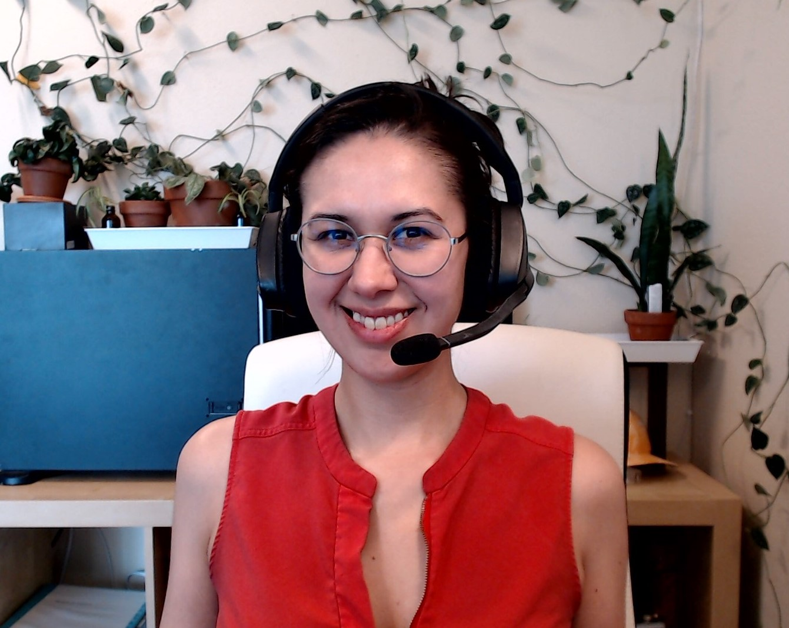

# About me

My name is Lydia Doza and I am a cybersecurity researcher master's degree student at Portland State University \(PSU\). 

I spent my childhood in Alaska and moved to Oregon to go to university. I received my Bachelor's from the Oregon Institute of Technology in 2019. While in undergrad, I spent a lot of time doing community outreach and being a STEM \(Science, Technology, Engineering, Mathematics\) advocate, trying to inspire others to go into a STEM field. My work [gained national recognition](https://obamawhitehouse.archives.gov/blog/2016/01/10/meet-guests-first-ladys-2016-state-union-box), and I was invited by former FLOTUS Michelle Obama to the 2016 State of the Union Address, for my work in promoting STEM to underprivileged kids.

I have carried the passion of sharing STEM by joining the [American Indian Science and Education Society, Lower Columbia Willamette River](https://sites.google.com/site/aiseslcwr/) professional chapter, where I keep the website up-to-date with our latest news and agenda for our monthly meetings.

Recently, I have also been elected as the PR/Community Outreach officer of the void\* vikings security club at PSU, where I plan recruiting and community engagement events for the club. The mission of void\* vikings is: 

> Promoting security culture, ethics, research, ongoing education, and development of safer code through playing and competing in CTF competitions.

