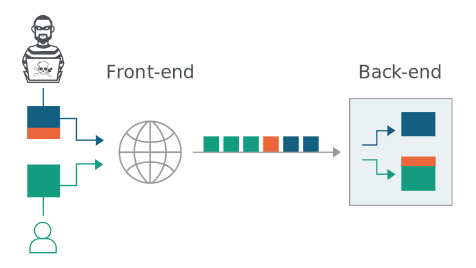

# Notes on HTTP Request Smuggling

## About these notes

This page contains the notes I took while reading the Portswigger Academy site about[ HTTP request smuggling.](https://portswigger.net/web-security/request-smuggling)

The images found in these notes are also from Portswigger, so that I may refer back to them quickly 

## What is HTTP request smuggling?

A technique to take advantage of vulnerabilities in the way websites process requests to bypass security controls. This allows the unauthorized access to sensitive data and can allow a direct compromise to other application users.

According to Portswigger, ti was first documented in 2005 and then popularized by [Portswigger's research on the topic](https://portswigger.net/research/http-desync-attacks-request-smuggling-reborn).

### What happens in an HTTP request smuggling attack?

* web apps frequently have chains of HTTP servers between users and business/app logic
  * users send request to a front-end server/load balancer/reverse proxy
    * this server forwards the reqs to 1+ back-end servers
  * this architecture is becoming more common, and is sometimes unavoidable especially in cloud-based apps
* front-end servers typically send many reqs to the same back-end network connection for performance and efficiency
  * HTTP reqs are sent in sequence
  * receiving server parses the HTTP req headers to determin where one req ends and the next begins

An attacker can take advantage of vulnerabilities in this system by structuring their one request to be interpreted by the back-end server as more than request.

### How do HTTP request smuggling vulnerabiliteis arise?

* The HTTP spec provides two ways to define the end of a request: `Content-Length` header and `Transfer-Encoding` header.
* `Content-Length` header specifies length of message body in bytes
  * `POST /search HTTP/1.1 Host: normal-website.com Content-Type: application/x-www-form-urlencoded Content-Length: 11  q=smuggling`
* `Transfer-Encoding` specifies message body uses chunked encoding, that the message body has one or more chunks of data. 
  * Each chunk has 
    * \(hex\) size in bytes
    * newline
    * the chunk of contents
    * ending with a chunk of size zero
  * `POST /search HTTP/1.1 Host: normal-website.com Content-Type: application/x-www-form-urlencoded Transfer-Encoding: chunked  b q=smuggling 0`


chunked encoding is sometimes overlooked by security testers   
\* burp suite automatically handles chunked encoding  
\* since it is not handled by browsers and normally only in server responses


* If both `Content-Length` and `Transfer-Encoding` headers are present, the HTTP spec states that the `Content-Length` header should be ignored. 
* However, this is not always easy to enforce when there is a chain of servers.
  * some servers don't support `Transfer-Encoding` in reqs
  * some servers that do support `Transfer-Encoding` may not process it if the header is obfuscated
  * It is possible for the for front-end servers to behave differently from the back-end servers
    * the servers can disagree about the boundaries between successive requests
      * REQEUST SMUGGLING!

### How to perform an HTTP Request Smuggling attack

* Place both `Content-Length` and `Transfer-Encoding` headers into a single HTTP request.
* Structure requests so front-end and back-end servers process the request differently.

#### CL.TE

Front-end server uses `Content-Length` and the back-end server uses `Transfer-Encoding`

`POST / HTTP/1.1  
Host: vulnerable-website.com  
Content-Length: 13  
Transfer-Encoding: chunked  
  
0  
  
SMUGGLED`

The front-end processes Content-Length, determines req body is 13 bytes long, up to the end of SMUGGLED, then forwards the req to the back-end.

back-end processes Transfer-Encoding header, treats body as using chunked encoding.

* processes first chunk, zero length \(terminator\)
* SMUGGLED are left unprocessed, back-end treats these as being the start of the next req

#### TE.CL

Front-end server users `Transfer-Encoding` and the back-end server uses `Content-Length`

#### TE.TE

both front-end and back-end server use `Transfer-Encoding` header, but one of thes ervers can be induced to not process it by obfuscating the header in some way

### How to prevent HTTP request smuggling

* disable reuse of back-end connections, so that each back-end requests uses its own connection
* Use HTTP/2 for back-end connections, since it prevents ambiguity about the boundaries between requests
* Use exactly same web server software for front-end and back-end, so they agree about the boundaries between the requests
* make front-end server normalize ambiguous requests \(not as good due to error-prone nature\)
* make back-end server reject ambiguous requests \(not as good due to error-prone nature\)

